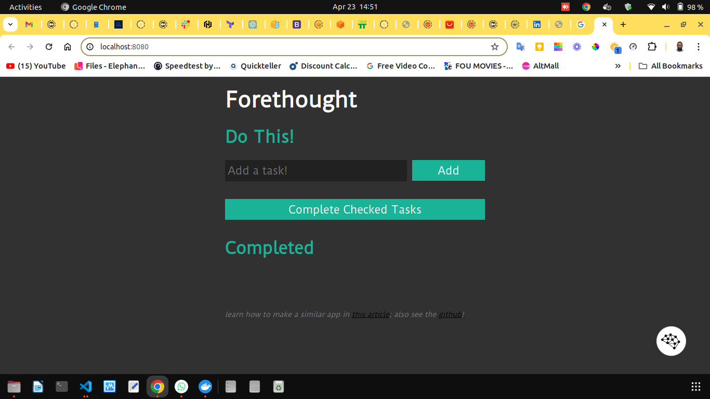

# To-Do List Application

This is a simple to-do list application demo developed using Node.js and Express.

## Table of Contents

- [To-Do List Application](#to-do-list-application)
  - [Table of Contents](#table-of-contents)
  - [Directory structure](#directory-structure)
  - [Steps to achieve the project](#steps-to-achieve-the-project)
    - [Step 1: Download the Node.js application](#step-1-download-the-nodejs-application)
    - [Step 2: Unpack the application](#step-2-unpack-the-application)
    - [Step 3: Create a Dockerfile](#step-3-create-a-dockerfile)
    - [Step 4: Build the Docker image](#step-4-build-the-docker-image)
    - [Step 5: Run the Docker container](#step-5-run-the-docker-container)
  - [Usage ](#usage-)
  - [Project output](#project-output)
  - [Dependencies ](#dependencies-)
  - [Contributing](#contributing)
  - [License](#license)

## Directory structure
- app
  - index.js
  - node_modules
    - body-parser
  - index.ejs
  - Dockerfile

## Steps to achieve the project

### Step 1: Download the Node.js application

Use the `wget` command in your terminal to download the application from the provided GitHub link:

wget https://github.com/linuxacademy/content-Introduction-to-Containers-and-Docker/raw/master/lessonfiles/demo-app.tar


### Step 2: Unpack the application

Extract the downloaded tar file using the following command:

```bash
tar -xvf app.tar
```

This will create a new directory called `app` containing the application files.

### Step 3: Create a Dockerfile

In the `app` directory, create a new file named `Dockerfile` with no extension and copy the following content in the file created:

```Dockerfile
FROM node:10-alpine

WORKDIR /app

COPY package*.json ./

RUN npm install

COPY . .

RUN npm run build

EXPOSE 8080

CMD ["npm", "index.js"]
```

This Dockerfile uses the official Node.js 10 Alpine image, sets up the application directory, installs dependencies, copies files, builds the application, exposes port 8080, and sets the default command to start the application.

### Step 4: Build the Docker image

Run the following command to build the Docker image:

```bash
docker build -t my-todo-app .
```

This command will create a Docker image with the name `my-todo-app`.

### Step 5: Run the Docker container

Use the following command to spin up a new container from the `my-todo-app` image:

```bash
docker run -p 8080:8080 my-todo-app
```

This command maps port 8080 on the host machine to port 8080 in the container, allowing you to access the application from outside the container.

## Usage <a name="usage"></a>

Once the Docker container is running, you can access the application by navigating to [http://localhost:8080](http://localhost:8080) in your web browser.

## Project output 



## Dependencies <a name="dependencies"></a>

The application relies on the following dependencies:

- [Index](./index.js): Web framework for Node.js
- [Body-parser](./node_modules/body-parser): Middleware for parsing HTTP request bodies
- [EJS](./views/index.ejs): Templating engine for rendering HTML files

## Contributing 

Contributions are welcome! If you find any bugs or want to suggest improvements, feel free to open an issue or submit a pull request.

## License 
This project is licensed under the ISC License. See the [LICENSE](https://opensource.org/licenses/ISC) file for details.
